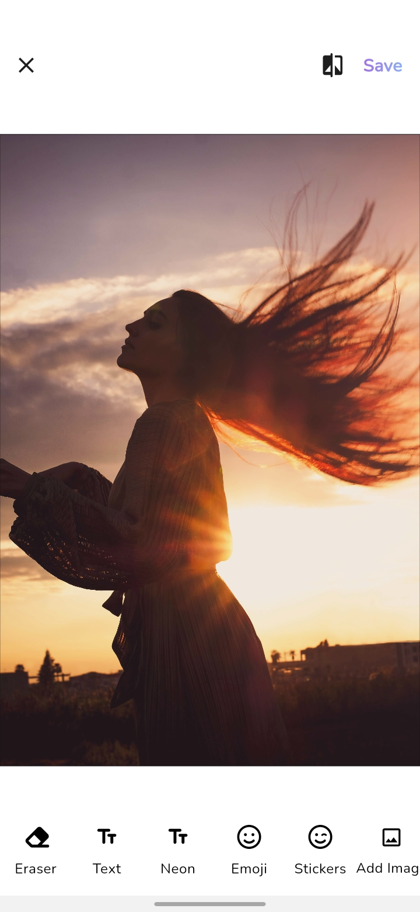

# SnapFusion Image and Video Editor App

Welcome to our Flutter-based Image and Video Editor App! This app provides users with a seamless experience for editing both images and videos on their mobile devices. Whether you need to add filters, crop, or apply effects, our app has got you covered.

## Features
- **Image Editing**: Crop, rotate, resize, apply filters, add text, and more to your images.
- **Video Editing**: Trim, merge, add music, apply effects, and enhance your videos effortlessly.
- **Intuitive Interface**: User-friendly interface for easy navigation and editing.
- **Cross-platform Compatibility**: Works seamlessly on both Android and iOS devices.

## How to Start
To run the app on your local machine, follow these steps:

1. **Clone the Repository**: 
    ```
    git clone <repository_url>
    ```

2. **Navigate to the Project Directory**:
    ```
    cd folder
    ```

3. **Install Dependencies**:
    ```
    flutter pub get
    ```

4. **Run the App**:
    ```
    flutter run
    ```

5. **Enjoy Editing!**: Once the app is running on your device or emulator, you can start editing images and videos with ease.

## Screenshots





## Feedback and Contributions
We welcome feedback and contributions from the community. If you encounter any issues or have suggestions for improvement, please feel free to open an issue or submit a pull request on our GitHub repository.

## About
For any inquiries, you can reach us at [anmolgarg263@gmail.com].

Happy Coding! 🎨🎬
